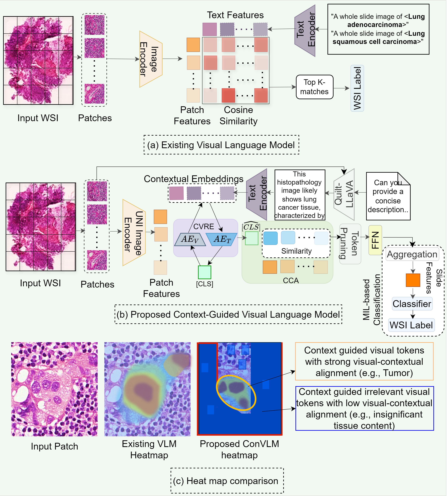
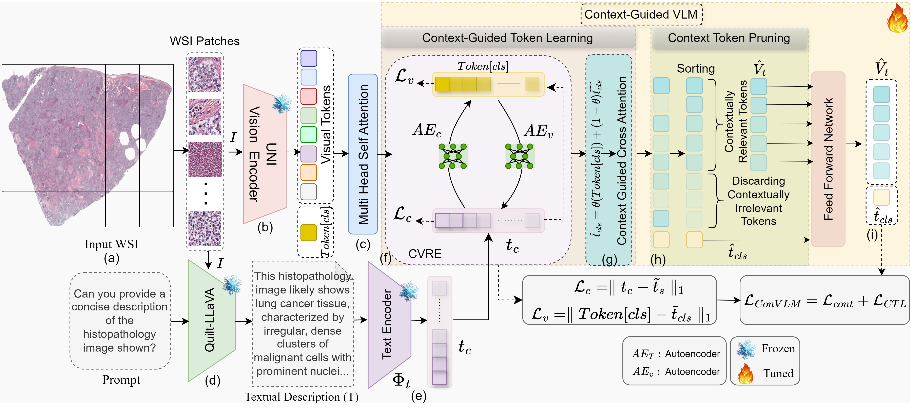
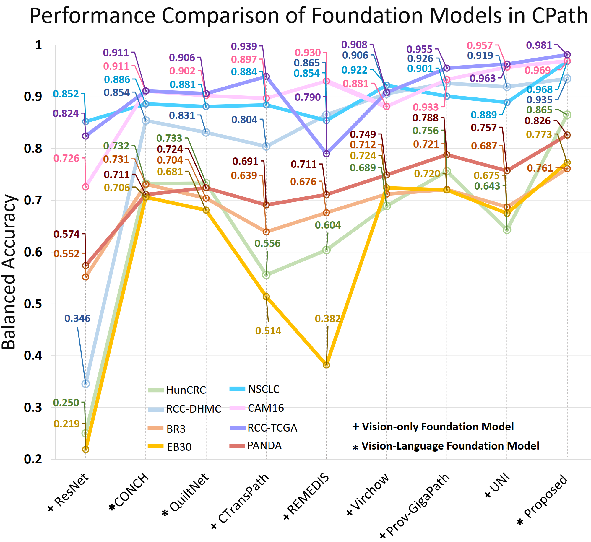

# ConVLM: Context-Guided Vision-Language Model for Fine-Grained Histopathology Image Classification



### Abstract
Vision-Language Models (VLMs) have recently demonstrated exceptional results across various Computational Pathology (CPath) tasks, such as Whole Slide Image (WSI) classification and survival prediction. These models utilize large-scale datasets to align images and text by incorporating language priors during pre-training. However, the separate training of text and vision encoders in current VLMs leads to only coarse-level alignment, failing to capture the fine-level dependencies between image-text pairs. This limitation restricts their generalization in many downstream CPath tasks. In this paper, we propose a novel approach that enhances the capture of finer-level context through language priors, which better represent the fine-grained tissue morphological structures in histology images. We propose a Context-guided Vision-Language Model (ConVLM) that generates contextually relevant visual embeddings from histology images. ConVLM achieves this by employing context-guided token learning and token pruning modules to identify and eliminate contextually irrelevant visual tokens, refining the visual representation. These two modules are integrated into various layers of the ConVLM encoders to progressively learn context-guided visual embeddings, enhancing visual-language interactions. The model is trained end-to-end using a context-guided token learning based loss function. We conducted extensive experiments on 20 histopathology datasets, evaluating both Region of Interest (ROI)-level and cancer subtype WSI-level classification tasks. The results indicate that ConVLM significantly outperforms existing State-of-the-Art (SOTA) vision-language and foundational models.



## 1. Environment Setup 

This setup is tested only on Linux.

1. Clone this repository and navigate to ConVLM
```
git clone https://github.com/BasitAlawode/ConVLM.git ConVLM
cd ConVLM
```

2. Install Packages
```
conda create -n convlm python=3.10 -y
conda activate convlm
pip install --upgrade pip  # enable PEP 660 support
pip install -e .
```

## 2. Dataset Preparation

1. Download the dataset and and organize them as follows:

        .
        ├── data
        │   ├── CAM16/
        │   ├── NSCLC_TCGA/
        │   └── RCC_DHMC/
        └── ···


2. Dataset for WSI is prepared by segmenting the tissue region and making ROI patches using [CLAM](https://github.com/mahmoodlab/CLAM).


## 3. Vision Features are Extracted using following:

1. The  visual features for patch-level and ROI-level are extracted using [UNI model](https://github.com/mahmoodlab/UNI).
    
    ```
     python ConVLM_visual_feature_extraction.py
     ```


## 4. Text Generation with [Quilt-LLaVA]( https://quilt-llava.github.io/)

1. open generate_text.py in your favourite text editor

2. Give the path to the images folder by editing line 19.

3. In this work, we have answered the question:
    ```
    questions = ["Can you provide a concise description of the histopathology image shown?"]
    ```
    and the following Quilt-LlaVA configuration has been used:
    ```
    ckpt = "wisdomik/Quilt-Llava-v1.5-7b"
    temp, conv_mode = 0, "vicuna_v1"
    ```
    You can change this to the Quilt-LlaVA model you want to use (see lines 22 and 23). 

4. Run:

    ```
    python generate_text.py
    ```

## 5. ConVLM for training and inference
1. Modify the config file by adding the dataset name, and embedding dimensions.

2. Run the following script for the training of ConVLM:
    ```
    python train.py
    ```

3. Inference


## 6. Performance Comparison

Performance Comparison of proposed ConVLM with Existing SOTA Foundation Models in CPath. Balanced accuracy results for the proposed ConVLM model compared to various SOTA foundation models across multiple CPath datasets. ConVLM consistently outperforms both vision-only and vision-language foundation models by a substantial margin. Please see the figure below.



## Acknowledgement
Our work is based on the below repositories:
 - [Quilt-LLaVA](https://github.com/aldraus/quilt-llava)
 - [CLAM](https://github.com/mahmoodlab/CLAM)
 - [UNI model](https://github.com/mahmoodlab/UNI)

We appreciate the authors for making their code and models available.

